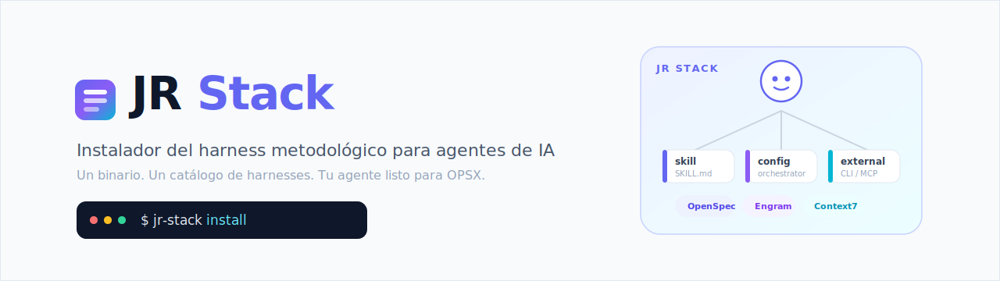
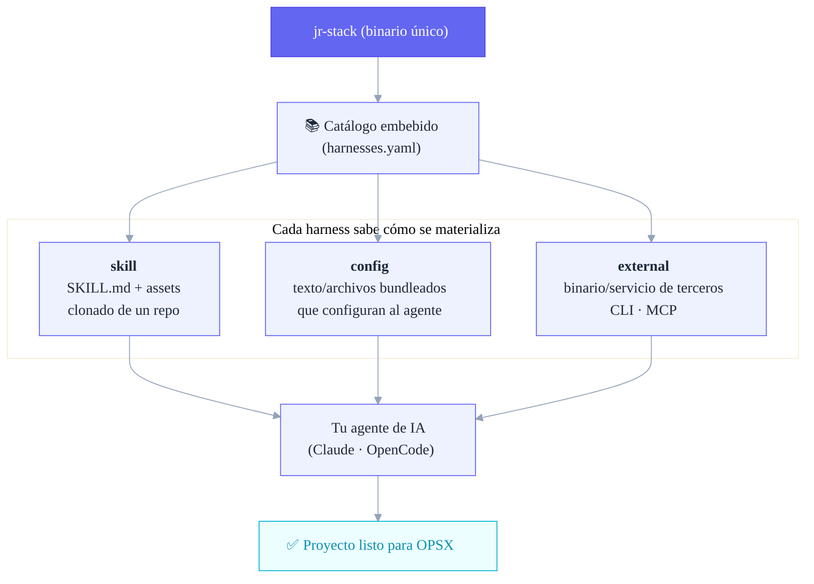
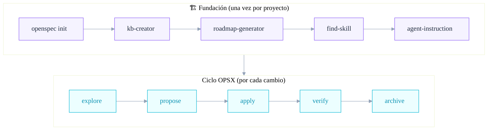

<p align="center">
  
</p>

<p align="center">
  
  
  
  
  
</p>

<p align="center">
  <b>Un binario. Un catálogo de harnesses. Tu agente de IA listo para trabajar con método.</b>
</p>

---

## ¿Qué es esto?

**JR Stack** es un **instalador _methodology-first_**: un único binario en Go que toma tu agente de IA (Claude Code, OpenCode…) y le **inyecta, de forma modular y actualizable, todo el sustrato que exige una metodología de desarrollo asistido por IA.**

No es un framework que corre en tu app. Es un **configurador del entorno del agente**. Corrés un comando, elegís un modo, y el stack deja tu proyecto listo para el ciclo **OPSX** (`explore → propose → apply → verify → archive`).

La idea central, en una frase:

> **JR Stack es un harness que instala harnesses.**

Un *harness* es cualquier módulo que prepara o guía el entorno de la IA. JR Stack lleva embebido un **catálogo maestro** de harnesses y sabe cómo materializar cada uno según su tipo.

### ¿Qué NO es?

Para que quede claro el alcance (decisiones firmes de diseño):

- ❌ No es un code-reviewer en commit.
- ❌ No instala themes, statusline ni keybindings (nada cosmético).
- ❌ No es un producto de marketing ni "supercharge any agent".

Es una herramienta enfocada: **instalar y configurar el sustrato metodológico, nada más.**

---

## El concepto: un harness de harnesses



Hay **tres tipos** de harness, y el instalador no instala "repos": instala harnesses, y cada uno declara cómo se baja/configura.

| Tipo | Qué es | De dónde sale | Ejemplos |
|------|--------|---------------|----------|
| **`skill`** | `SKILL.md` + assets, cargada bajo demanda | repo propio o de terceros, se clona al instalar | `kb-creator`, `roadmap-generator`, `jr-orchestrator`, `find-skill` |
| **`config`** | Texto/archivos que configuran al agente | bundleado en el binario | `sdd-orchestrator`, `permissions` |
| **`external`** | Binario/servicio de terceros | se instala/configura (no es nuestro) | `OpenSpec`, `Engram`, `Context7` |

---

## Quick start

> **Estado:** el binario se construye desde fuente (releases pre-compilados: _próximamente_).

```bash
# 1. Cloná y compilá
git clone https://github.com/JuanCruzRobledo/jr-stack.git
cd jr-stack
go build -o jr-stack ./cmd/jr-stack

# 2. Instalá el stack (TUI interactiva)
./jr-stack install
```

### Modos de uso del comando

```bash
jr-stack install                 # TUI interactiva (Bubbletea): elegís agente y modo
jr-stack install --dry-run       # Muestra el plan de instalación, no ejecuta nada
jr-stack install --mode full     # Instalación headless (no interactiva)
jr-stack install --agent claude  # Apuntá a un agente concreto
jr-stack install --help          # Todos los flags
```

Pasar `--mode` o `--agent` activa el modo **headless** automáticamente (ideal para CI o scripts).

---

## Modos de instalación

El catálogo agrupa los harnesses en tres presets. Convención: un harness de Lite también está en Full (Full incluye a Lite); Custom te deja elegir uno por uno.

| Modo | Qué instala | Para qué |
|------|-------------|----------|
| **Lite** | El **sustrato** mínimo: `openspec`, `engram`, `context7`, `sdd-orchestrator`, `permissions` | Empezar a trabajar con la metodología ya |
| **Full** | Sustrato **+ fundación guiada**: `jr-orchestrator` y las skills que orquesta (`kb-creator`, `roadmap-generator`, `agent-instruction`, `skill-registry`, `find-skill`, `skill-creator`) | El ecosistema completo, proyecto desde cero |
| **Custom** | Vos elegís cada harness | Control total — con una excepción 👇 |

> 🔒 **`permissions` no es desactivable.** Incluso en Custom, el harness de seguridad (permisos *security-first*) queda forzado. La seguridad no es opcional.

---

## El catálogo de harnesses

Lo que JR Stack puede instalar hoy (fuente de verdad: [`internal/catalog/harnesses.yaml`](internal/catalog/harnesses.yaml)):

| Harness | Tipo | Modo | Qué hace |
|---------|------|------|----------|
| **OpenSpec CLI** | external | lite · full | CLI de Spec-Driven Development; fuente de verdad del estado |
| **Engram** | external | lite · full | Memoria persistente local (SQLite + FTS) vía MCP |
| **Context7** | external | lite · full | Documentación de librerías al día (MCP remoto) |
| **SDD Orchestrator** | config | lite · full | Orquestador SDD componible por toggles (TDD, Engram, model-routing, delegación, governance) |
| **Permissions** | config | lite · full | Permisos seguros por defecto (bloquea `.env`, confirma git destructivo) — **no opcional** |
| **jr-orchestrator** | skill | full | Orquestador delgado de la fase de fundación |
| **kb-creator** | skill | full | Genera la knowledge-base canónica del dominio |
| **roadmap-generator** | skill | full | Genera `CHANGES.md` (backlog técnico) desde la KB |
| **agent-instruction** | skill | full | Genera `AGENTS.md`/`CLAUDE.md` con todas las referencias |
| **skill-registry** | skill | full | Crea/actualiza el registro de skills del proyecto |
| **find-skill** | skill (terceros) | full | Busca y recomienda skills relevantes |
| **skill-creator** | skill (terceros) | full | Crea nuevas skills siguiendo la spec de Agent Skills |

El **`sdd-orchestrator`** es el harness clave: es de tipo `config` y se compone a partir de **toggles modulares** (`tdd`, `engram`, `model-routing`, `delegation`, `governance`). El resultado es el bloque de instrucciones del orquestador que se inyecta en el `CLAUDE.md` / `AGENTS.md` de tu proyecto.

---

## Cómo funciona la instalación

`jr-stack install` no copia archivos a lo bruto. Resuelve dependencias, hace backup, inyecta con markers idempotentes y verifica:

```mermaid
%%{init: {'theme':'base','themeVariables':{'primaryColor':'#eef2ff','primaryBorderColor':'#6366f1','primaryTextColor':'#1e293b','lineColor':'#94a3b8','fontFamily':'sans-serif'}}}%%
flowchart LR
    A["1 · Detectar<br/>OS · arch · agentes · deps"] --> B["2 · Elegir<br/>agente(s)"]
    B --> C["3 · Elegir modo<br/>Lite · Full · Custom"]
    C --> D["4 · Resolver catálogo<br/>árbol de dependencias"]
    D --> E["5 · Backup<br/>de configs existentes"]
    E --> F["6 · Instalar<br/>externals + harnesses"]
    F --> G["7 · Inyectar configs<br/>merge por markers"]
    G --> H["8 · Verificar<br/>health checks"]

    classDef safe fill:#fef2f2,color:#b91c1c,stroke:#f87171;
    class E,G safe;
```



Tres garantías **no negociables** del instalador (los pasos marcados arriba en rojo):

- 🛟 **Nunca pisa tu config sin backup** — snapshot antes de escribir, con restore.
- 🧩 **Inyección idempotente por markers** — reinstalar no duplica bloques.
- ↩️ **Rollback por etapas** — si un paso falla, deshace lo hecho (sin tocar lo que ya existía).

---

## De la instalación al código

Una vez instalado el stack, hay **una fase de fundación** (una vez por proyecto) y después el **ciclo iterativo** (una vez por cambio):



El `jr-orchestrator` coordina la fundación con lazy-loading de skills; durante el ciclo, **OpenSpec CLI es la fuente de verdad del estado** y el orquestador delega el trabajo pesado a sub-agentes.

---

## Agentes y plataformas

**Agentes soportados hoy** (con adapter funcional):

| Agente | Estado |
|--------|--------|
| **Claude Code** | ✅ Soportado |
| **OpenCode** | ✅ Soportado |
| Gemini · Codex · Cursor · VS Code · Windsurf · Antigravity | 🔜 En el modelo de dominio, adapter en roadmap |

> Agregar un agente es deliberadamente barato: un sub-paquete con el adapter + una entrada en el registry. Ningún installer ni interfaz existente cambia.

**Plataformas:** Windows · macOS · Linux · WSL · Termux — binario único cross-platform.

---

## Arquitectura

JR Stack es Go 1.26 + [Bubbletea](https://github.com/charmbracelet/bubbletea)/Lipgloss para la TUI, con el catálogo embebido en el binario vía `//go:embed`.

```
cmd/jr-stack/            entrypoint CLI
internal/
  system/                detección OS/arch/WSL/Termux, deps, guards
  catalog/               parseo del harnesses.yaml embebido
  model/                 tipos de dominio (harness, agente, modo)
  planner/               grafo de dependencias, orden de instalación
  agents/                adapters por agente (claude/opencode/…)
  harness/               install/inject por tipo (skill · config · external)
  filemerge/             merge por markers (inyectar sin pisar)
  backup/                snapshot + restore de configs
  pipeline/              ejecución por etapas + rollback
  verify/                health checks post-install
  tui/                   Bubbletea
assets/                  catálogo + configs bundleadas
```

El blueprint completo del diseño vive en **[ARCHITECTURE.md](ARCHITECTURE.md)**. El roadmap de cambios, en **[CHANGES.md](CHANGES.md)**.

---

## Build desde fuente

```bash
git clone https://github.com/JuanCruzRobledo/jr-stack.git
cd jr-stack
go build -o jr-stack ./cmd/jr-stack   # binario
go test ./...                          # suite completa
```

---

## Estado del proyecto

🟢 **Activo.** El núcleo del instalador (catálogo, modelo, adapters P0, backup/rollback, merge por markers, pipeline, verify y la TUI) está implementado y verde en CI. El roadmap interno (C-01 … C-25) está cerrado; ver [`CHANGES.md`](CHANGES.md).

## Licencia

> ⚠️ **Por definir.** Todavía no hay archivo `LICENSE` en el repo. Hasta que se agregue, todos los derechos quedan reservados por defecto.

---

<p align="center">
  <sub>Construido con Go + Bubbletea · methodology-first · made by <a href="https://github.com/JuanCruzRobledo">Juan Cruz Robledo</a></sub>
</p>
